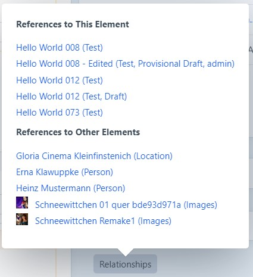

# Element Map for Craft 5

This plugin adds a button to the sidebar of full-page element editors that allows content administrators to see, at a glance, the relationships between elements.

## Requirements

* Craft CMS 5.0.0-beta.2 or above

This is just a provisional port for Craft 5 with minimal adjustments. 

It is not fully tested and not recommended for production use.

Use as a starting point for your own plugin development.

## Installation

1. Open a terminal and navigate to your project folder:

```bash
cd /path/to/project
```

2. Require the package to download it via Composer:

```bash
composer require wsydney76/elementmap5
```

3. Install the plugin via the command line:

```bash
./craft install/plugin elementmap5
```

## Usage



When editing an entry or asset in the full-page editor, you will be presented a button in the sidebar that will open a popup with two lists.

1. **References to This Element** lists the elements which contain the currently edited element somewhere in their fields.

2. **References to Other Elements** lists the elements which the currently edited element contains somewhere in its fields.

In case of nested elements (e.g. a Matrix field within a Matrix field), the plugin will recursively search for references and link to that nested entry.

Both lists provide links to the related elements' editors or control panel sections for quick access.

### Entry index

Adds columns to the entry index table that show references to and from each entry.

---

## Limitations

Not tested in multi-site environments.

Not performance optimized.

Does not support deprecated element types (like categories, tags, globals, etc. Some dead code is still.)

Only supports core element types (as plugins like super table or commerce are not yet available right now).

Code is not cleaned up/quality checked (in fact it's a mess...).


## License

Original, now abandoned plugin built for [Craft CMS](https://craftcms.com/) by Charlie Development. See license.md for more information.

